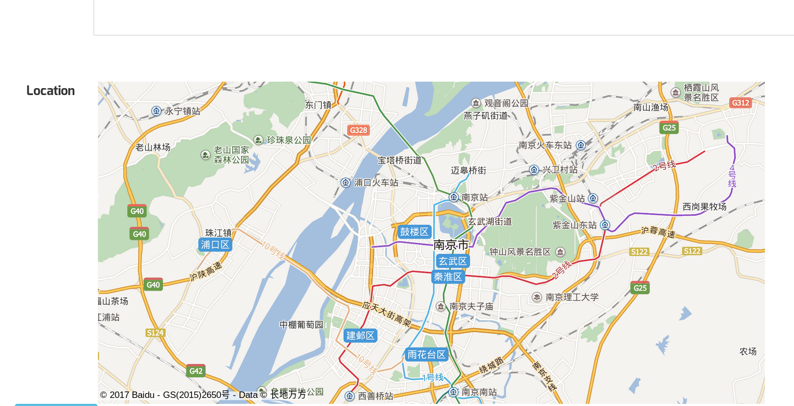

# HotelWorld 文档
## 数据库设计
### ER图

### 数据库表（表名，各列名及数据类型，外键关系）

    CREATE TABLE IF NOT EXISTS users (
    id BIGINT NOT NULL AUTO_INCREMENT,
    username VARCHAR(255) NOT NULL UNIQUE ,
    password VARCHAR(255) NOT NULL ,
    enabled BOOLEAN NOT NULL DEFAULT TRUE ,
    accountNonExpired BOOLEAN NOT NULL DEFAULT TRUE ,
    accountNonLocked BOOLEAN NOT NULL DEFAULT TRUE ,
    credentialsNonExpired BOOLEAN NOT NULL DEFAULT TRUE ,
    PRIMARY KEY (id)
    );

    CREATE TABLE IF NOT EXISTS user_authorites (
    uid BIGINT NOT NULL,
    authority VARCHAR(255) NOT NULL ,
    PRIMARY KEY (uid,authority),
    FOREIGN KEY uid(uid) REFERENCES users(id) ON DELETE CASCADE ON UPDATE CASCADE
    );

    CREATE TABLE IF NOT EXISTS persistent_logins (
    username varchar(64) not null,
    series varchar(64) not null,
    token varchar(64) not null,
    last_used timestamp not null,
    PRIMARY KEY (series)
    );

    CREATE TABLE IF NOT EXISTS usercards (
    id BIGINT NOT NULL UNIQUE ,
    username VARCHAR(255) NOT NULL UNIQUE ,
    pay_password VARCHAR(255) NOT NULL  ,
    onDate TIMESTAMP ,
    amount DOUBLE DEFAULT 0 NOT NULL ,
    level INT DEFAULT 0 NOT NULL ,
    grades INT DEFAULT 0 NOT NULL ,
    cost DOUBLE DEFAULT 0 NOT NULL ,
    PRIMARY KEY (id),
    FOREIGN KEY uuid(id) REFERENCES users(id) ON DELETE CASCADE ON UPDATE CASCADE ,
    FOREIGN KEY uname(username) REFERENCES users(username) ON DELETE CASCADE  ON UPDATE CASCADE
    );

    CREATE INDEX cards ON usercards (id,username,pay_password);

    CREATE TABLE IF NOT EXISTS bankcard (
    id BIGINT NOT NULL ,
    bankid VARCHAR(255) NOT NULL ,
    PRIMARY KEY (id,bankid),
    FOREIGN KEY bcid(id) REFERENCES users(id) ON DELETE CASCADE ON UPDATE CASCADE
    );

    CREATE TABLE IF NOT EXISTS hotels (
    id BIGINT AUTO_INCREMENT,
    name VARCHAR(255) NOT NULL ,
    city VARCHAR(255) NOT NULL ,
    locationX DOUBLE NOT NULL ,
    locationY DOUBLE NOT NULL ,
    passed BOOLEAN DEFAULT NULL ,
    manager VARCHAR(255) NOT NULL ,
    manager_id BIGINT NOT NULL ,
    manager_identity VARCHAR(255) NOT NULL ,
    description TEXT NOT NULL ,
    PRIMARY KEY (id),
    FOREIGN KEY hotelmanager(manager_id) REFERENCES users(id) ON DELETE CASCADE ON UPDATE CASCADE
    );

    CREATE TABLE IF NOT EXISTS plans (
    id BIGINT AUTO_INCREMENT,
    hid BIGINT NOT NULL ,
    mid BIGINT NOT NULL ,
    date TIMESTAMP NOT NULL ,
    city VARCHAR(255) NOT NULL ,
    room VARCHAR(255) NOT NULL ,
    people INT NOT NULL DEFAULT 1,
    price DOUBLE NOT NULL DEFAULT 1,
    confirmed BOOLEAN NOT NULL DEFAULT FALSE ,
    description TEXT NOT NULL ,
    PRIMARY KEY (id),
    FOREIGN KEY p_hid(hid) REFERENCES hotels(id) ON UPDATE CASCADE ON DELETE CASCADE ,
    FOREIGN KEY p_mid(mid) REFERENCES users(id) ON UPDATE CASCADE ON DELETE CASCADE
    );

    CREATE TABLE IF NOT EXISTS bookrecords (
    id BIGINT AUTO_INCREMENT,
    hid BIGINT NOT NULL ,
    mid BIGINT NOT NULL ,
    cid BIGINT DEFAULT NULL ,
    start TIMESTAMP NOT NULL ,
    end TIMESTAMP NOT NULL ,
    room VARCHAR(255) NOT NULL ,
    passed BOOLEAN DEFAULT NULL ,
    faceChecked BOOLEAN DEFAULT FALSE ,
    price DOUBLE NOT NULL DEFAULT 0,
    total DOUBLE NOT NULL DEFAULT 0,
    inCash BOOLEAN DEFAULT FALSE NOT NULL ,
    payed BOOLEAN DEFAULT TRUE  NOT NULL ,
    rooted BOOLEAN DEFAULT FALSE NOT NULL ,
    PRIMARY KEY (id),
    FOREIGN KEY b_hid(hid) REFERENCES hotels(id) ON DELETE CASCADE ON UPDATE CASCADE ,
    FOREIGN KEY b_mid(mid) REFERENCES users(id) ON DELETE CASCADE ON UPDATE CASCADE ,
    FOREIGN KEY b_cid(cid) REFERENCES users(id) ON DELETE CASCADE ON UPDATE CASCADE
    );

    CREATE TABLE IF NOT EXISTS payrecords (
    id BIGINT AUTO_INCREMENT,
    uid BIGINT NOT NULL ,
    username VARCHAR(255) NOT NULL ,
    amount DOUBLE NOT NULL DEFAULT 0,
    date TIMESTAMP NOT NULL ,
    PRIMARY KEY (id),
    FOREIGN KEY pr_uid(uid) REFERENCES users(id) ON DELETE CASCADE ON UPDATE CASCADE
    );

    CREATE TABLE IF NOT EXISTS people (

    id BIGINT NOT NULL AUTO_INCREMENT,
    bid BIGINT NOT NULL ,
    cid BIGINT NOT NULL,
    PRIMARY KEY (id)
    );

## 架构设计
### 工程的项目结构截图

### 后端框架
* spring
* spring-mvc
* spring-security
* spring-data-jpa
* hibernate
### 前端框架
* jquery
* bootstrap
* echart
* BaiduMap
* jstl

### 打包war截图

## 类设计
### 各包的类：名称与职责

| class                                      | responsibility                     |
|--------------------------------------------|------------------------------------|
| controller.middle.MyAuthenticationProvider | provide SQL security auth  service |
| controller.middle.SecurityFilter           | Config spring-security             |
| controller.servlet.BookController          | user booking logic                 |
| controller.servlet.GetController           | http get jsp                       |
| controller.servlet.HotelController         | hotel daily logic                  |
| controller.servlet.Index                   | for homepage response              |
| controller.servlet.RootController          | for root user logic                |
| controller.servlet.StatisticController     | calculate statistics & draw chart  |
| controller.servlet.UserController          | for common user logic              |
| controller.timer.VIPTask                   | schedule daily work                |
| model.dao.BookRecordDAO                    | CRUD for BookRecord                |
| model.dao.UserDAO                          | CRUD for User                      |
| model.dao.HotelDAO                         | CRUD for Hotel                     |
| model.dao.PayRecordDAO                     | CRUD for PayRecord                 |
| model.dao.PeopleDAO                        | CRUD for People                    |
| model.dao.PlanDAO                          | CRUD for Plan                      |
| model.dao.UserCardDAO                      | CRUD for Usercard                  |
| BookRecord                                 | DataBase entity                    |
| Hotel                                      | DataBase entity                    |
| PayRecord                                  | DataBase entity                    |
| People                                     | DataBase entity                    |
| Plan                                       | DataBase entity                    |
| User                                       | DataBase entity                    |
| UserCard                                   | DataBase entity                    |
| PlanBean                                   | to show plan                       |

### 前端的页面：名称及功能

| page url          | responsibility                 |
|-------------------|--------------------------------|
| /index            | homepage                       |
| /register/choice  | choose user's role             |
| /register/card    | register as customer           |
| /register/manager | register as hotel manager      |
| /pay/confirm      | pay for user card              |
| /book             | search for rooms               |
| /book/available   | search results                 |
| /book/new         | confirm book & pay online      |
| /self             | customer self center           |
| /hotel/manage     | hotel manage its daily work    |
| /hotel/newPlan    | hotel publish new plan         |
| /hotel/change     | change hotel info              |
| /statistic/hotel  | hotel's input & output         |
| /root/passList    | verify new hotel's application |
| /root/statistic   | hotel world's input & output   |
| /root/sum         | auto calculate money           |
## 其他
### 开发环境
* jdk-1.8.0_121
* Tomcat-9
* MySQL 5.6
* Intellij Elimate
* fedora-linux-25
* firefox-52.0
### 额外补充
采用了百度地图的内嵌网页地图，截图如下

实现了实时定位、判断距离以及汇总结果的功能
